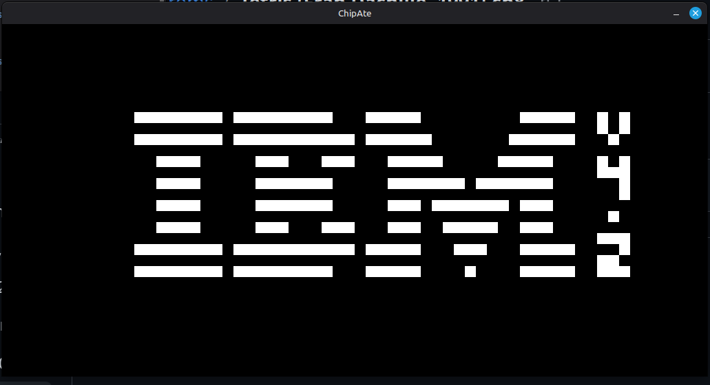
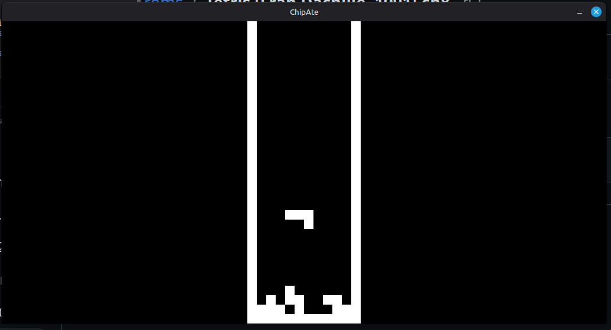

# chipAte

Sorry for the garbage name\
But this is yet another chip-8 emulator that I made in the odin programmign language. It uses Odin and SDL2


### Testing and References

I have used Cowgod's chip8 reference to implement this emulator

This project was tested using Timendus' chip8 test suite.
The test ROMS are included under the GNU General Public License v3.0 (GPL3 license)

I have added the LICENSE to the test suite with the roms.

## Screenshots






## How to Run
build using ```odin build src/ -out:c8```\
run the executable through terminal with suitable arguements\
```./c8 <path to rom>```
