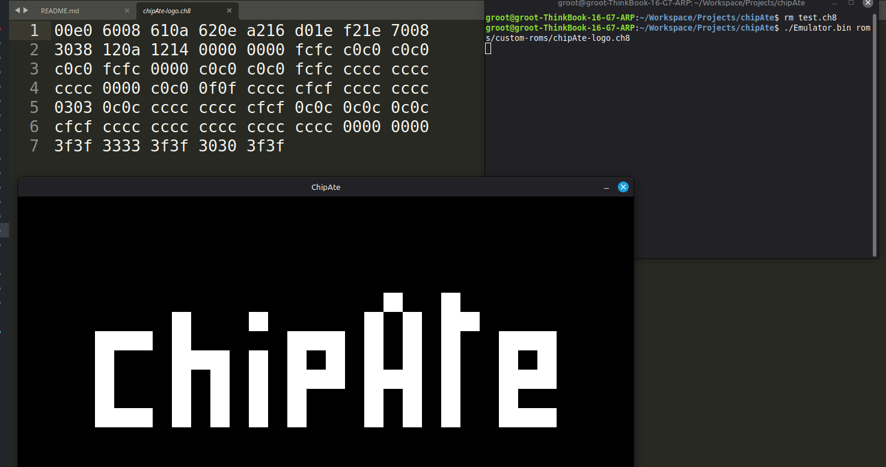

# chipAte
A chip8 emulator written in Odin.


## About
The emulator implements the complete original Chip-8 instruction set according to Cowgod's specification.
The emulator was tested using Timendus' chip8 test suite and passes all the tests for the classic chip8.

It started out as a simple chip8 emulator but then I decided to write my own rom on it. I wrote a simple chipAte-logo rom, manually, hex by hex, and since that was so tedious to do so, I wrote an assembler and a disassembler for the machine. Using the new assembler, I also made another chipAte-idle-animation rom for the machine.

The emulator uses SDL2 for windowing, rendering, input, etc, while the assembler and disassembler are both cli based apps

Super Chip-8 and XO-Chip instructions are not implemented yet but the emulator architecture is flexible enough that they can be implemented easily in the future. The emulator already  has an emulator_mode enum which is currently used only for the quirks, which can be used while implementing the other instructions


All the assembly and roms written by me as well as the test ROMs used to test the emulator are stored in the roms directory.
The test ROMs by Timendus are included under the GPL3 license


## Screenshots




## How to Build and Run

Make sure you have Odin and SDL2 already installed in your system


### Emulator

**Configure**

Modify the configurable variables inside the source code or leave them at their defaults

SCALE - Display Scaling

EXECUTION_FREQUENCY - Emulation Speed

BG_COLOR - Background Color (unimplemented)

FG_COLOR - Foreground Color (unimplemented)


**Build:**

```odin build Emulator```

**Run:**

```./Emulator.bin <path to chip-8 rom>```


### Assembler

**Build:**

```odin build Assembler```

**Run:**

```./Assembler.bin <path to chip-8 assembly>``` to print the output to stdout

use ```-o <path to output file>``` to write it to a file


### Disassmbler

**Build:**

```odin build Disassembler```

**Run:**

```./Disassembler.bin <path to chip-8 rom>``` to print the output to stdout

use ```-o <path to output file>``` to write it to a file


### Input Mapping
Escape to exit

1 2 3 C | 1 2 3 4

4 5 6 D | Q W E R

7 8 9 E | A S D F

A 0 B F | Z X C V


## Assembly format/specification

- newline separated instructions

- space separated operands

- anything after a ; till the new line character is considered a comment

- : for labels


## Future improvements / TODO
- implement the super-chip-8 opcodes
- DEBUG MODE OR SOMETHING


## License
This project is licensed under the MIT License. See the `LICENSE` file for more details.
